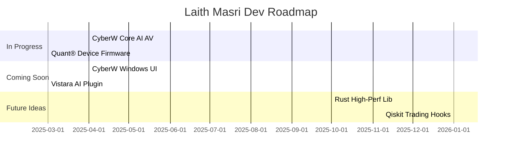

<p align="center">
  
</p>

<h1 align="center">🧠 Laith Masri</h1>

<p align="center">
  MEng Electrical & Electronic Engineering @ Aston<br/>
  Full-stack + embedded systems dev • Future quant • AI, finance, and systems thinker
</p>

<p align="center">
  <a href="https://laithmasri.dev">🌐 Website</a> •
  <a href="mailto:admin@laithmasri.dev">📧 Email</a> •
  <a href="https://github.com/laithm">🐙 GitHub</a> •
  <a href="https://linkedin.com/in/laithmasri">💼 LinkedIn</a>
</p>

<p align="center">
  
  
  
  
</p>

---

## ⚡ About Me

- 🛠️ Building **Vistara** – full-stack SaaS + AI integration  
- 🧠 Developing **CyberW** – open-source, AI-powered rolling-release antivirus  
- 🔧 Designing **hardware trading device** with onboard Wi-Fi, alpha execution  
- 📊 Focused on **quant finance**, **AI/ML**, and **low-level system design**  
- 💻 Dual-booting **Arch Linux + Windows** on Zenbook Duo  
- 🌍 Learning: **Rust**, **Qiskit**, **Mandarin**, and **HPC**

---

## 📦 Notable Projects

| Project | Description |
|--------|-------------|
| 🔷 [Vistara](https://github.com/laithm/vistara) | SaaS platform w/ frontend + backend |
| 🧬 [zenbook-duo-arch](https://github.com/laithm/zenbook-duo-arch) | Dual-screen Arch setup (Hyprland) |
| 🧪 [quant-lab](https://github.com/laithm/quant-lab) | Quant research: alpha modeling |
| 💻 [laithmasri.dev](https://github.com/laithm/laithmasri-dev) | Portfolio + blog |
| 🛡️ **CyberW** *(coming soon)* | Modular AI antivirus for Windows |
| 📟 **Quant Device** *(in dev)* | Embedded trading engine |

---

## 🛠️ Tech Stack

```yaml
Languages: Python, TypeScript, C/C++, Bash, Lua, Markdown
Frameworks: React, Next.js, Node.js, Express, TailwindCSS, Qiskit
Tools: Git, Arch Linux, Docker, ESP32, MATLAB, MongoDB, VSCode
```

---

## 📊 GitHub Stats

<p align="center">
  
  
</p>

<p align="center">
  
</p>

---

## 🗺️ Roadmap & Timeline



---

## 🧭 Mission

> Build high-performance systems. Understand everything from electrons to algorithms.  
> Leave behind tools, code, and models that outlive me.

---

*Last updated: 2025-06-17*
