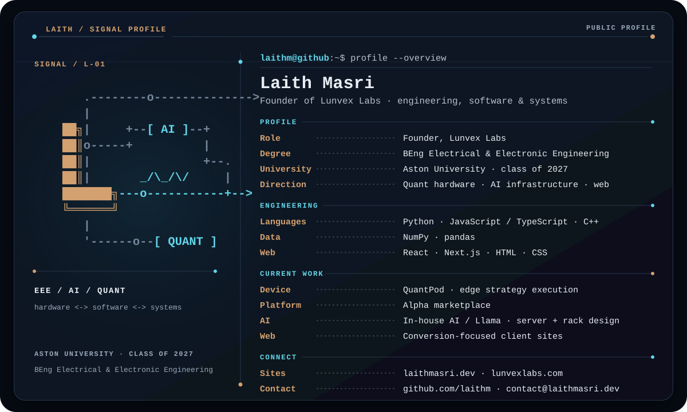
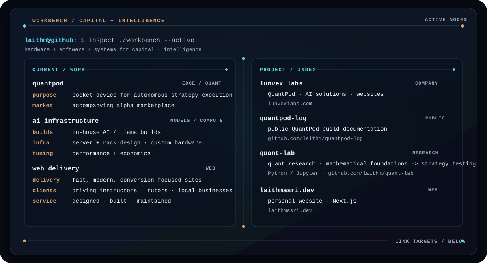
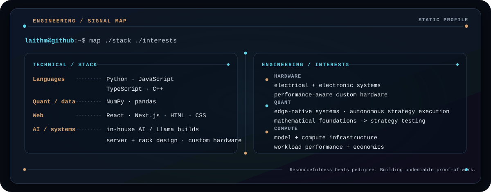

<picture>
  <source media="(max-width: 640px)" srcset="./assets/profile-terminal-mobile.svg">
  
</picture>

  <a href="https://laithmasri.dev"><code>laithmasri.dev</code></a> ·
  <a href="https://lunvexlabs.com"><code>lunvexlabs.com</code></a> ·
  <a href="https://github.com/laithm"><code>github/laithm</code></a>
   
  <a href="https://linkedin.com/in/laithmasri"><code>linkedin/laithmasri</code></a> ·
  <a href="mailto:contact@laithmasri.dev"><code>contact@laithmasri.dev</code></a>

<picture>
  <source media="(max-width: 640px)" srcset="./assets/work-terminal-mobile.svg">
  
</picture>

  <a href="https://github.com/laithm/quantpod-log"><code>repo/quantpod-log</code></a> ·
  <a href="https://github.com/laithm/quant-lab"><code>repo/quant-lab</code></a>

<picture>
  <source media="(max-width: 640px)" srcset="./assets/stack-terminal-mobile.svg">
  
</picture>

<code>laithm@github:~$ cat profile.txt  # text mode</code>

### About

I’m **Laith Masri**, founder of [Lunvex Labs](https://lunvexlabs.com), building hardware, software and systems for capital and intelligence across quant hardware, AI infrastructure and modern web delivery.

I study **BEng Electrical & Electronic Engineering** at **Aston University**, class of 2027.

### Current work and projects

- [**QuantPod / public build log**](https://github.com/laithm/quantpod-log) — a pocket device for autonomous strategy execution, with an accompanying alpha marketplace.
- **AI infrastructure** — in-house AI and Llama builds, server and rack design, and custom hardware tuned for performance and economics.
- **Web delivery** — fast, modern, conversion-focused sites designed, built and maintained for driving instructors, tutors and local businesses.
- [**quant-lab**](https://github.com/laithm/quant-lab) — quant research from mathematical foundations to strategy testing using Python and Jupyter.
- [**laithmasri.dev**](https://laithmasri.dev) — personal website built with Next.js.

### Technical stack

- **Languages:** Python, JavaScript, TypeScript and C++.
- **Quant and data:** NumPy and pandas.
- **Web:** React, Next.js, HTML and CSS.
- **AI and systems:** in-house AI and Llama builds, server and rack design, and custom hardware.

### Engineering interests

Electrical and electronic systems, edge-native quant systems, autonomous strategy execution, quantitative research, and workload-aware model and compute infrastructure.

### Connect

[GitHub](https://github.com/laithm) · [LinkedIn](https://linkedin.com/in/laithmasri) · [Personal site](https://laithmasri.dev) · [Lunvex Labs](https://lunvexlabs.com) · [Email](mailto:contact@laithmasri.dev)

> *Resourcefulness beats pedigree. Building undeniable proof-of-work.*

